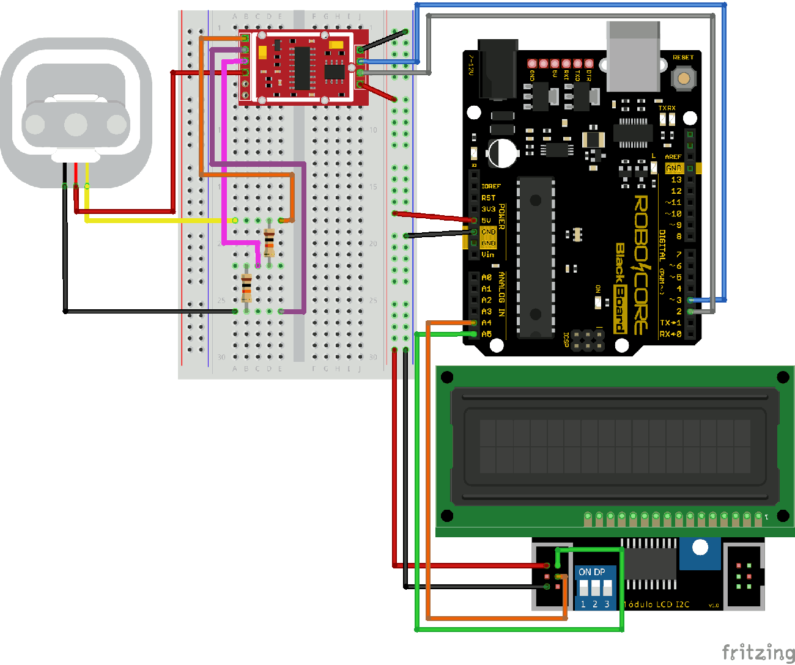

# Projeto de Balança Eletrônica com Arduino e Sensor HX711

## Descrição

Balanças estão presentes em diversas ocasiões em nosso dia, seja para comprar pão com uma regulação fina para medir até mesmo miligramas (mg), ou até mesmo para a pesagem de caminhões que ficam na beira das estradas, com uma variação bem mais robusta para a pesagem de toneladas. Elas nos informam o quanto devemos pagar por produtos, quantos quilos nossos corpos pesam, ou até mesmo para a aplicação da lei, impedindo que caminhões com sobrecarga rodem nas rodovias federais, por exemplo.

Embora uma balança seja muito utilizada, e em alguns casos indispensável, seu custo é elevado por uma série de fatores, seja pela precisão, pela calibragem, ou até mesmo pelo peso máximo suportado. Neste tutorial você vai aprender em poucos passos como fazer uma balança capaz de suportar até 50 kg, além de entender como é feita a calibragem por software.

## Componentes Utilizados

- **Arduino** (Qualquer modelo compatível)
- **Sensor de Carga HX711**
- **Display LCD I2C**
- **Módulo Wi-Fi ESP8266** (para comunicação remota, opcional)
- **Fios jumper e protoboard**

## Esquema de Montagem

A seguir, o diagrama esquemático da montagem de todos os componentes. O sensor HX711 é conectado ao Arduino para a leitura dos dados de peso, que são exibidos no display LCD. O módulo Wi-Fi ESP8266 pode ser adicionado para enviar os dados para um servidor ou aplicativo.



## Passos de Implementação

### 1. Conectar o Sensor HX711
O sensor HX711 é conectado ao Arduino através de pinos específicos para garantir uma comunicação correta. Ele será responsável pela leitura da pressão sobre as células de carga, que é convertida em um valor de peso.

### 2. Conectar o Display LCD I2C
O display LCD I2C é usado para mostrar o valor do peso medido pelo sensor de carga. Ele facilita a visualização em tempo real dos dados do sensor.

### 3. (Opcional) Conectar o Módulo Wi-Fi ESP8266
Com a adição do módulo Wi-Fi ESP8266, você pode fazer a comunicação dos dados da balança com uma rede sem fio, permitindo o envio de informações para uma aplicação ou para a nuvem.

## Código de Exemplo

```cpp
#include <HX711.h>
#include <Wire.h>
#include <LiquidCrystal_I2C.h>

HX711 scale;

LiquidCrystal_I2C lcd(0x27, 16, 2);  // Endereço do display LCD I2C

void setup() {
  Serial.begin(9600);
  lcd.begin();
  lcd.print("Balança Inicializando...");
  
  // Inicializa o sensor HX711
  scale.begin(A1, A0);  // Defina os pinos de leitura e de dados
  scale.set_scale();     // Ajuste da calibração
  scale.tare();          // Zera o valor inicial
  lcd.clear();
}

void loop() {
  lcd.setCursor(0, 0);
  lcd.print("Peso: ");
  lcd.print(scale.get_units(), 1);  // Exibe o peso em kg
  
  delay(1000);
}
